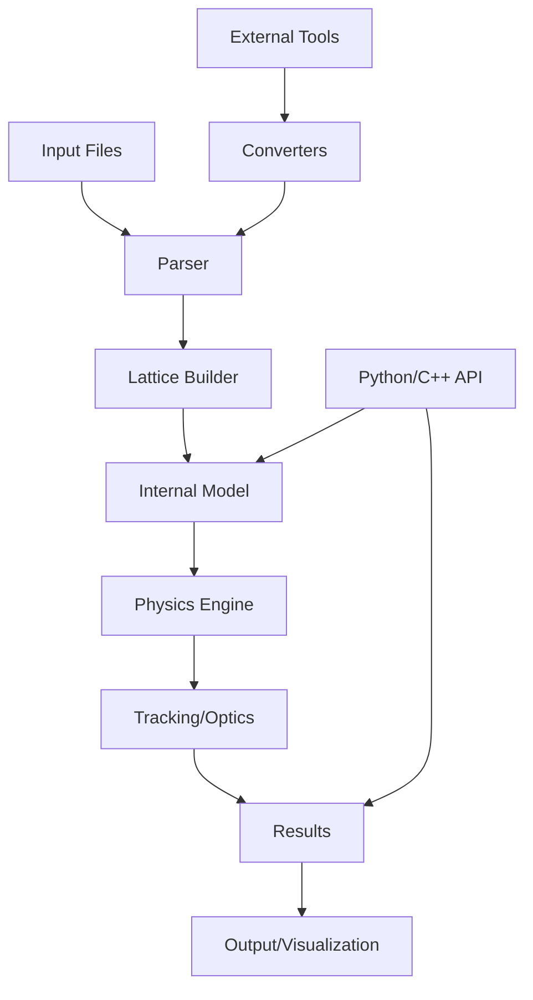

# Bmad Ecosystem Architecture

## System Overview

The Bmad ecosystem is a comprehensive toolkit for charged particle and X-ray simulation in accelerators and storage rings. This architecture document outlines the system design for building modern accelerator physics applications using Bmad.

## Architecture Layers

### 1. Core Physics Engine (Fortran)
```
┌─────────────────────────────────────────────┐
│              Bmad Core Library              │
│  ┌────────────────────────────────────────┐│
│  │ • Particle Tracking                    ││
│  │ • Optics Calculations                  ││
│  │ • Field Maps                           ││
│  │ • Spin Dynamics                        ││
│  │ • Synchrotron Radiation               ││
│  │ • Collective Effects                   ││
│  └────────────────────────────────────────┘│
└─────────────────────────────────────────────┘
```

### 2. Simulation Layer
```
┌─────────────────────────────────────────────┐
│           Simulation Programs               │
│  ┌──────────┐  ┌──────────┐  ┌──────────┐ │
│  │   Tao    │  │   BSIM   │  │   Lux    │ │
│  │ (Optics) │  │(Tracking)│  │(X-rays)  │ │
│  └──────────┘  └──────────┘  └──────────┘ │
└─────────────────────────────────────────────┘
```

### 3. Interface Layer
```
┌─────────────────────────────────────────────┐
│            Language Bindings                │
│  ┌──────────┐  ┌──────────┐  ┌──────────┐ │
│  │  PyTao   │  │ C++ API  │  │ Julia    │ │
│  │ (Python) │  │          │  │ Bindings │ │
│  └──────────┘  └──────────┘  └──────────┘ │
└─────────────────────────────────────────────┘
```

### 4. Application Layer
```
┌─────────────────────────────────────────────┐
│         High-Level Applications             │
│  ┌──────────────────────────────────────┐  │
│  │ • Machine Learning Integration       │  │
│  │ • Optimization Frameworks            │  │
│  │ • Control System Interfaces          │  │
│  │ • Visualization Tools                │  │
│  └──────────────────────────────────────┘  │
└─────────────────────────────────────────────┘
```

## Component Architecture

### Core Components

#### 1. Lattice Management
- **Purpose**: Define and manipulate accelerator lattices
- **Key Classes**:
  - `lat_struct`: Main lattice container
  - `ele_struct`: Element representation
  - `branch_struct`: Beamline branches

#### 2. Tracking Engine
- **Purpose**: Simulate particle motion through elements
- **Modules**:
  - `bmad_track_mod`: Single particle tracking
  - `beam_mod`: Multi-particle beam tracking
  - `space_charge_mod`: Collective effects

#### 3. Optics Calculations
- **Purpose**: Compute linear and nonlinear optics
- **Modules**:
  - `twiss_mod`: Twiss parameters
  - `mat6_mod`: Transfer matrices
  - `normal_form_mod`: Normal form analysis

### Data Flow Architecture



## Design Patterns

### 1. Factory Pattern
Used for creating lattice elements based on type:
```fortran
type(ele_struct) function create_element(ele_type)
  select case (ele_type)
    case (quadrupole$)
      ! Initialize quadrupole
    case (rfcavity$)
      ! Initialize RF cavity
    ...
  end select
end function
```

### 2. Strategy Pattern
For different tracking algorithms:
```fortran
interface track_particle
  module procedure track_runge_kutta
  module procedure track_symplectic
  module procedure track_taylor_map
end interface
```

### 3. Observer Pattern
Event system for tracking updates:
```python
class TrackingObserver:
    def on_turn_complete(self, particle, turn):
        # Log or analyze particle state
        pass
```

## Integration Architecture

### File Format Support
```
┌──────────────┐    ┌──────────────┐    ┌──────────────┐
│   MAD-X      │───▶│              │───▶│              │
├──────────────┤    │              │    │              │
│   Elegant    │───▶│  Converters  │───▶│  Bmad Format │
├──────────────┤    │              │    │              │
│   SAD        │───▶│              │───▶│              │
└──────────────┘    └──────────────┘    └──────────────┘
```

### API Architecture

#### Python Integration (PyTao)
```python
# High-level API design
class Accelerator:
    def __init__(self, lattice_file):
        self.tao = Tao(lattice_file)

    def track(self, particles, turns=1):
        return self.tao.track(particles, turns)

    def optimize(self, variables, targets):
        return self.tao.optimize(variables, targets)
```

#### C++ Integration
```cpp
// Modern C++ wrapper design
class BmadAccelerator {
public:
    BmadAccelerator(const std::string& lattice_file);

    TrackingResult track(const ParticleBundle& particles);
    OpticsResult calculate_optics();

private:
    std::unique_ptr<BmadCore> core_;
};
```

## Scalability Architecture

### Parallel Processing
```
┌────────────────────────────────────┐
│      Master Process (Rank 0)       │
│  • Lattice initialization          │
│  • Work distribution               │
└────────────────┬───────────────────┘
                 │
    ┌────────────┼────────────┐
    │            │            │
┌───▼───┐  ┌────▼───┐  ┌────▼───┐
│Worker 1│  │Worker 2│  │Worker N│
│Particle│  │Particle│  │Particle│
│Tracking│  │Tracking│  │Tracking│
└────────┘  └────────┘  └────────┘
```

### Memory Management
- **Particle Bunches**: Efficient array storage
- **Element Caching**: Reuse transfer maps
- **Field Map Compression**: Interpolated grids

## Deployment Architecture

### Container-based Deployment
```dockerfile
FROM ubuntu:24.04
RUN conda install -c conda-forge bmad
COPY lattice_files /workspace/lattices
CMD ["tao", "-startup", "/workspace/startup.tao"]
```

### Cloud Architecture
```yaml
apiVersion: apps/v1
kind: Deployment
metadata:
  name: bmad-simulation
spec:
  replicas: 4
  template:
    spec:
      containers:
      - name: bmad-worker
        image: bmad:latest
        resources:
          requests:
            memory: "8Gi"
            cpu: "4"
```

## Security Architecture

### Access Control
- Read-only lattice files
- Sandboxed execution environment
- Input validation for parameters

### Data Protection
- Encrypted storage for sensitive designs
- Audit logging for parameter changes
- Version control integration

## Performance Optimization

### Caching Strategy
1. **Transfer Map Cache**: Store computed maps
2. **Field Map Interpolation**: Pre-computed grids
3. **Twiss Parameter Cache**: Reuse optics

### Optimization Techniques
- Vectorized operations for particle bunches
- SIMD instructions for field calculations
- GPU acceleration for tracking (optional)

## Monitoring and Observability

### Metrics Collection
```python
class SimulationMetrics:
    def __init__(self):
        self.tracking_time = []
        self.particle_losses = []
        self.memory_usage = []

    def record_turn(self, stats):
        # Collect performance metrics
        pass
```

### Logging Architecture
```
Application Logs ─────▶ Log Aggregator ─────▶ Analysis Dashboard
     │                        │                      │
     ├─ Debug logs           ├─ Filter/Parse       ├─ Visualization
     ├─ Warning logs         └─ Store               └─ Alerts
     └─ Error logs
```

## Future Architecture Considerations

### Machine Learning Integration
```python
class MLOptimizer:
    def __init__(self, accelerator):
        self.acc = accelerator
        self.model = load_surrogate_model()

    def optimize_tune(self):
        # Use ML for rapid optimization
        return self.model.predict_optimal_settings()
```

### Digital Twin Architecture
```
Physical Accelerator ◄──────► Digital Twin
        │                           │
        ├─ Real-time data          ├─ Bmad simulation
        ├─ Control system          ├─ Predictive model
        └─ Diagnostics             └─ Optimization
```

## Best Practices

### Code Organization
```
bmad-ecosystem/
├── src/
│   ├── core/           # Core physics
│   ├── tracking/       # Tracking algorithms
│   ├── optics/         # Optics calculations
│   └── interfaces/     # API bindings
├── tests/
│   ├── unit/          # Unit tests
│   ├── integration/   # Integration tests
│   └── regression/    # Regression tests
├── docs/
│   ├── api/           # API documentation
│   └── tutorials/     # User guides
└── examples/
    ├── basic/         # Simple examples
    └── advanced/      # Complex use cases
```

### Testing Strategy
1. **Unit Tests**: Individual components
2. **Integration Tests**: Module interactions
3. **Physics Tests**: Validation against known results
4. **Performance Tests**: Benchmarking

## Conclusion

This architecture provides a scalable, maintainable foundation for accelerator physics simulations. The modular design allows for:
- Easy integration with external tools
- Performance optimization at multiple levels
- Extension through plugins and custom modules
- Support for modern computing paradigms

The system is designed to evolve with advancing computational methods while maintaining backward compatibility with existing lattice files and workflows.